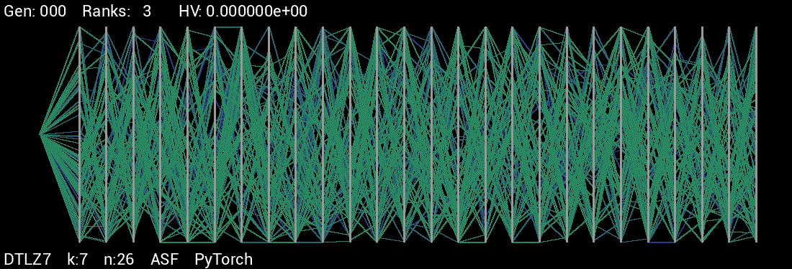
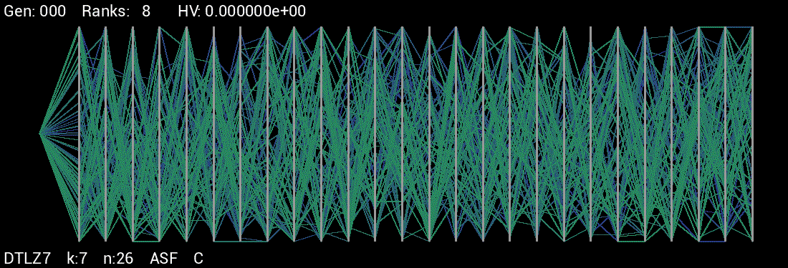

# iMOACO<sub>R</sub> - PyTorch Implementation
A PyTorch implementation of Falcón-Cardona and Coello Coello's iMOACO<sub><b>R</b></sub>, an indicator-based many-objective ant colony optimization algorithm for continuous search spaces.
The original journal article is available for purchase <a href="https://link.springer.com/chapter/10.1007%2F978-3-319-45823-6_36">here</a>, while an older version is available to view <a href="http://computacion.cs.cinvestav.mx/%7ejfalcon/iMOACOR/iMOACOR-PPSN2016.pdf">here</a>.

During the development of this project, a strong emphasis was placed on obtaining runtime performance similar to that of the original C implementation, which has been achieved &ndash; even when using only 1 CPU core.
While this implementation's operation and behaviour differ slightly, the resulting Pareto optimal fronts are similar.

Dependencies
------
*	<b>Python3.5+</b>
*	<b>Numpy</b>
*	<b><a href="https://pytorch.org/get-started/locally/">PyTorch v1.0+</a></b>: Due to the current limitations of the JIT-compiler's tracing approach, some techniques were implemented that are not compatible with the previous versions of PyTorch. Note that GPU-acceleration is not leveraged, as this problem type would likely not benefit from it.


Usage
------
Run with the following command:

```
python3 iMOACOR.py <path to configuration file> [OPTIONS]
```

Options:
*	```-r N | --runs=N```: The number of runs to execute
*	```-s NAME | --scal=NAME```: Use the scalarization method named NAME
*	```--snapshots```: Write generational snapshots to the ```snapshots``` folder
*	```-h | --help```: Display the help page and exit

All configurations are included within the ```config``` folder.
Currently, the scalarization functions ```ASF``` (Achievement Scalarization Function) and ```VADS``` (Vector Angle Distance Scaling) are implemented.
By default, ```1``` run is executed using ```ASF```.
For each run, the resulting Pareto optimal set and Pareto optimal front are written to a subfolder of the ```output``` folder.

Currently, only the DTLZ test suite is implemented.

Many-Objective Optimization Performance
-----

The table below compares the optimization performance of the C implementation against the PyTorch implementation, noting the scalarization function used.
All experiments were run 30 times and used the same configurations.
DTLZ2 and DTLZ4 results were similar for all, while the PyTorch implementation generally fares slightly better in DTLZ5 and DTLZ6.
For DTLZ7, PyTorch with ASF performs better than C with ASF, although PyTorch with VADS performs drastically worse; this demonstrates the impact that the choice of scalarization may make.

<br>
<div align="center" style="overflow-x:auto;">
<table>
<caption align="bottom">Mean and standard deviation of the Hypervolume values obtained from the DTLZ test suite across 30 runs.
<br>A greater Hypervolume is better.</caption>
<thead>
	<tr>
    	<th style="text-align:center; border-bottom:thin black solid;">Problem</th>
        <th style="text-align:center; border-bottom:thin black solid;">Dims</th>
    	<th style="text-align:center; border-bottom:thin black solid;">C - ASF</th>
    	<th style="text-align:center; border-bottom:thin black solid;">PyTorch - ASF</th>
    	<th style="text-align:center; border-bottom:thin black solid;">PyTorch - VADS</th>
    </tr>
</thead>
<tr>
	<td bgcolor="#F0F0F0" style="text-align:center; border-bottom:thin black solid;" rowspan="3">DTLZ2</td>
	<td bgcolor="#F0F0F0" style="text-align:center">3</td>
	<td bgcolor="#F0F0F0" style="text-align:center">7.420231e+00(2.561e&ndash;04)</td>
	<td bgcolor="#F0F0F0" style="text-align:center">7.420099e+00(2.640e&ndash;04)</td>
	<td bgcolor="#F0F0F0" style="text-align:center">7.421886e+00(3.897e&ndash;04)</td>
</tr>
<tr style="border-bottom:thin black solid;">
	<td bgcolor="#F0F0F0" style="text-align:center">5</td>
	<td bgcolor="#F0F0F0" style="text-align:center">3.165018e+01(2.529e&ndash;03)</td>
	<td bgcolor="#F0F0F0" style="text-align:center">3.165292e+01(1.654e&ndash;03)</td>
	<td bgcolor="#F0F0F0" style="text-align:center">3.166400e+01(4.713e&ndash;03)</td>
</tr>
<tr>
	<td bgcolor="#F0F0F0" style="text-align:center; border-bottom:thin black solid;">7</td>
	<td bgcolor="#F0F0F0" style="text-align:center; border-bottom:thin black solid;">1.277012e+02(7.756e&ndash;03)</td>
	<td bgcolor="#F0F0F0" style="text-align:center; border-bottom:thin black solid;">1.277236e+02(6.245e&ndash;03)</td>
	<td bgcolor="#F0F0F0" style="text-align:center; border-bottom:thin black solid;">1.276529e+02(1.478e&ndash;01)</td>
</tr>

<tr>
	<td bgcolor="#FFFFFF" style="text-align:center; border-bottom:thin black solid;" rowspan="3">DTLZ4</td>
	<td bgcolor="#FFFFFF" style="text-align:center">3</td>
	<td bgcolor="#FFFFFF" style="text-align:center">7.419261e+00(9.233e&ndash;04)</td>
	<td bgcolor="#FFFFFF" style="text-align:center">7.418391e+00(1.030e&ndash;03)</td>
	<td bgcolor="#FFFFFF" style="text-align:center">7.398056e+00(9.607e&ndash;02)</td>
	</tr>
<tr>
	<td bgcolor="#FFFFFF" style="text-align:center">5</td>
	<td bgcolor="#FFFFFF" style="text-align:center">3.163519e+01(3.624e&ndash;03)</td>
	<td bgcolor="#FFFFFF" style="text-align:center">3.163822e+01(2.656e&ndash;03)</td>
	<td bgcolor="#FFFFFF" style="text-align:center">3.163021e+01(7.057e&ndash;02)</td>
</tr>
<tr>
	<td bgcolor="#FFFFFF" style="text-align:center; border-bottom:thin black solid;">7</td>
	<td bgcolor="#FFFFFF" style="text-align:center; border-bottom:thin black solid;">1.277266e+02(7.245e&ndash;03)</td>
	<td bgcolor="#FFFFFF" style="text-align:center; border-bottom:thin black solid;">1.277303e+02(4.940e&ndash;03)</td>
	<td bgcolor="#FFFFFF" style="text-align:center; border-bottom:thin black solid;">1.276833e+02(8.943e&ndash;02)</td>
</tr>
<tr>
	<td bgcolor="#F0F0F0" style="text-align:center; border-bottom:thin black solid;" rowspan="3">DTLZ5</td>
	<td bgcolor="#F0F0F0" style="text-align:center">3</td>
	<td bgcolor="#F0F0F0" style="text-align:center">5.983806e+01(7.194e&ndash;03)</td>
	<td bgcolor="#F0F0F0" style="text-align:center">5.983627e+01(1.014e&ndash;02)</td>
	<td bgcolor="#F0F0F0" style="text-align:center;">5.981663e+01(1.434e&ndash;02)</td>
	</tr>
<tr>
	<td bgcolor="#F0F0F0" style="text-align:center">5</td>
	<td bgcolor="#F0F0F0" style="text-align:center">9.372627e+02(9.321e&ndash;01)</td>
	<td bgcolor="#F0F0F0" style="text-align:center">9.445540e+02(1.338e+00)</td>
	<td bgcolor="#F0F0F0" style="text-align:center">9.423998e+02(2.317e+00)</td>
</tr>
<tr>
	<td bgcolor="#F0F0F0" style="text-align:center; border-bottom:thin black solid;">7</td>
	<td bgcolor="#F0F0F0" style="text-align:center; border-bottom:thin black solid;">1.444221e+04(1.115e+02)</td>
	<td bgcolor="#F0F0F0" style="text-align:center; border-bottom:thin black solid;">1.490116e+04(4.437e+01)</td>
	<td bgcolor="#F0F0F0" style="text-align:center; border-bottom:thin black solid;">1.490963e+04(5.938e+01)</td>
</tr>

<tr>
	<td bgcolor="#FFFFFF" style="text-align:center; border-bottom:thin black solid;" rowspan="3">DTLZ6</td>
	<td bgcolor="#FFFFFF" style="text-align:center">3</td>
	<td bgcolor="#FFFFFF" style="text-align:center">1.315942e+03(1.175e+00)</td>
	<td bgcolor="#FFFFFF" style="text-align:center">1.316013e+03(1.066e+00)</td>
	<td bgcolor="#FFFFFF" style="text-align:center">1.316235e+03(2.011e+00)</td>
	</tr>
<tr>
	<td bgcolor="#FFFFFF" style="text-align:center">5</td>
	<td bgcolor="#FFFFFF" style="text-align:center">1.563606e+05(1.388e+03)</td>
	<td bgcolor="#FFFFFF" style="text-align:center">1.547633e+05(1.130e+03)</td>
	<td bgcolor="#FFFFFF" style="text-align:center">1.578140e+05(1.681e+03)</td>
</tr>
<tr>
	<td bgcolor="#FFFFFF" style="text-align:center; border-bottom:thin black solid;">7</td>
	<td bgcolor="#FFFFFF" style="text-align:center; border-bottom:thin black solid;">1.801024e+07(2.869e+05)</td>
	<td bgcolor="#FFFFFF" style="text-align:center; border-bottom:thin black solid;">1.850276e+07(1.912e+05)</td>
	<td bgcolor="#FFFFFF" style="text-align:center; border-bottom:thin black solid;">1.897912e+07(3.123e+05)</td>
</tr>

<tr>
	<td bgcolor="#F0F0F0" style="text-align:center; border-bottom:thin black solid;" rowspan="3">DTLZ7</td>
	<td bgcolor="#F0F0F0" style="text-align:center">3</td>
	<td bgcolor="#F0F0F0" style="text-align:center">1.624747e+01(3.431e&ndash;02)</td>
	<td bgcolor="#F0F0F0" style="text-align:center">1.632806e+01(5.579e&ndash;03)</td>
	<td bgcolor="#F0F0F0" style="text-align:center">2.457880e+00(2.604e+00)</td>
	</tr>
<tr>
	<td bgcolor="#F0F0F0" style="text-align:center">5</td>
	<td bgcolor="#F0F0F0" style="text-align:center">1.256712e+01(8.935e&ndash;02)</td>
	<td bgcolor="#F0F0F0" style="text-align:center">1.289479e+01(2.891e&ndash;02)</td>
	<td bgcolor="#F0F0F0" style="text-align:center">1.602372e&ndash;01(3.348e&ndash;01)</td>
</tr>
<tr>
	<td bgcolor="#F0F0F0" style="text-align:center; border-bottom:thin black solid;">7</td>
	<td bgcolor="#F0F0F0" style="text-align:center; border-bottom:thin black solid;">8.283139e+00(2.093e&ndash;01)</td>
	<td bgcolor="#F0F0F0" style="text-align:center; border-bottom:thin black solid;">8.810581e+00(9.006e&ndash;02)</td>
	<td bgcolor="#F0F0F0" style="text-align:center; border-bottom:thin black solid;">3.675018e&ndash;03(4.040e&ndash;03)</td>
</tr>
</table>
</div>
<br>

Below are GIFs created from the results through the use of two of my other projects, <a href="https://github.com/shumaym/Hypervolume_Manager">Hypervolume Manager</a> and <a href="https://github.com/shumaym/Pareto_Set_Plotter">Pareto Set Plotter</a>.
Shown are the ```n```-dimensional spatial positions for each of the best solutions created up until the current generation, as determined by the R2-ranking algorithm.
Each bar represents one spatial dimension for the solutions, with positional values ranging from ```0``` &#8594; ```1``` from bottom to top.
Each solution is drawn starting at a nest node and traverses through each dimension from left to right.
The colour of a solution is determined by its rank relative to other solutions, with the greenest solutions being the lowest of rank, and the bluest solutions being the highest of rank; a solution of rank ```1``` means that it is nondominated, as in there exists no other current solution that is more optimal in all ```k``` objective functions.

<div align="center">
<figure>
	
    <figcaption>PyTorch &ndash; ASF: DTLZ7 in 7 dimensions</figcaption>
</figure>
<br>
<figure>
	
    <figcaption>C &ndash; ASF: DTLZ7 in 7 dimensions</figcaption>
</figure>
</div>